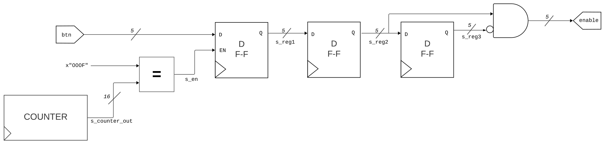
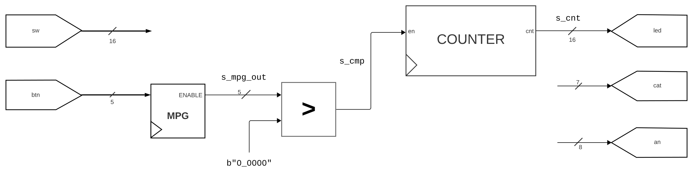

#### 5-bit Mono Pulse Generator


```vhdl
library ieee;
  use ieee.std_logic_1164.all;
  use ieee.std_logic_arith.all;
  use ieee.std_logic_unsigned.all;
  
entity mono_pulse_gener is
  port (
    -- INPUT / OUTPUT HERE

  );
end mono_pulse_gener;

architecture Behavioral of mono_pulse_gener is
  -- SIGNALS HERE
  
begin
  -- BEHAVIORAL CODE HERE

end Behavioral;
```

#### Test Environment


```vhdl
library ieee;
  use ieee.std_logic_1164.all;
  use ieee.std_logic_arith.all;
  use ieee.std_logic_unsigned.all;

entity test_env is
  port (
    clk : in  std_logic;
    btn : in  std_logic_vector(4  downto 0);
    sw  : in  std_logic_vector(15 downto 0);
    led : out std_logic_vector(15 downto 0);
    an  : out std_logic_vector(7  downto 0);
    cat : out std_logic_vector(6  downto 0)
  );
end entity test_env;

architecture behavioral of test_env is

  signal s_cmp : std_logic := '0';

  -- REST OF THE SIGNALS AND
  -- COMPONENT DECLARATIONS

begin

  s_cmp <= '1' when s_mpg_out > b"0_0000" else '0';

  -- REST OF THE BEHAVIORAL CODE AND
  -- COMPONENT INSTANTIATIONS

  -- THE COUNTER SHOULD NOT BE A SEPARATE ENTITY
  -- JUST WRITE THE CODE FOR IT HERE

end behavioral; 
```
