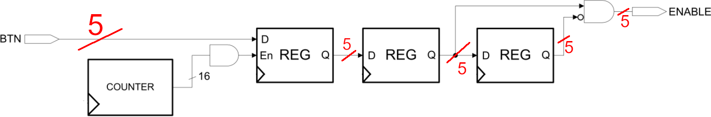
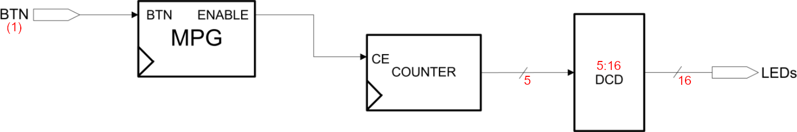
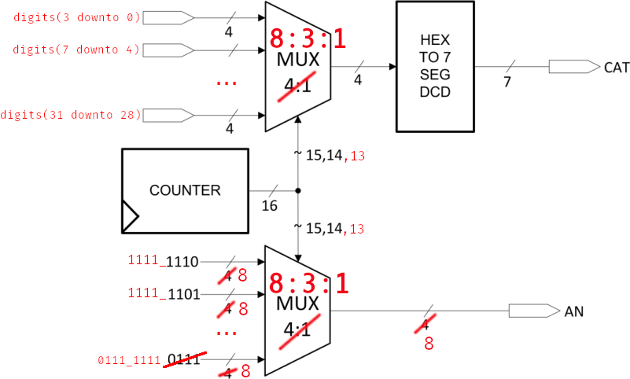

# Lab 2

## Components

### Component Declaration
**Between `arch` and `begin`**
```vhdl
component <entity name here from other file>
  port (
    <ports copy-paste here>;
    <ports copy-paste here>
  );
end component;
```

### Component Instantiation
**Between `begin` and `end behavioral`**
```vhdl
<instance name> : <entity name>
port map (
  <port name from other file> => <port or signal in this file>, -- notice the comma, not semi-colon!
  <port name from other file> => <port or signal in this file>
);
```


## 5-bit Mono Pulse Generator


## Decoder with 16-bit output with zero


## 7-segment Display


### Bottom Multiplexer
```vhdl
process (s_counter_out(15 downto 13))
  begin
    case s_counter_out(15 downto 13) is
      when "000"  => an <= b"1111_1110";
      when "001"  => an <= b"1111_1101";
      when "010"  => an <= b"1111_1011";
      when "011"  => an <= b"1111_0111";
      when "100"  => an <= b"1110_1111";
      when "101"  => an <= b"1101_1111";
      when "110"  => an <= b"1011_1111";
      when others => an <= b"0111_1111";
    end case;
  end process;
```

### Hex to 7-Seg Decoder
```vhdl
with s_top_mux select
    cat <= "1111001" when "0001",   --1
           "0100100" when "0010",   --2
           "0110000" when "0011",   --3
           "0011001" when "0100",   --4
           "0010010" when "0101",   --5
           "0000010" when "0110",   --6
           "1111000" when "0111",   --7
           "0000000" when "1000",   --8
           "0010000" when "1001",   --9
           "0001000" when "1010",   --A
           "0000011" when "1011",   --b
           "1000110" when "1100",   --C
           "0100001" when "1101",   --d
           "0000110" when "1110",   --E
           "0001110" when "1111",   --F
           "1000000" when others;   --0
```
