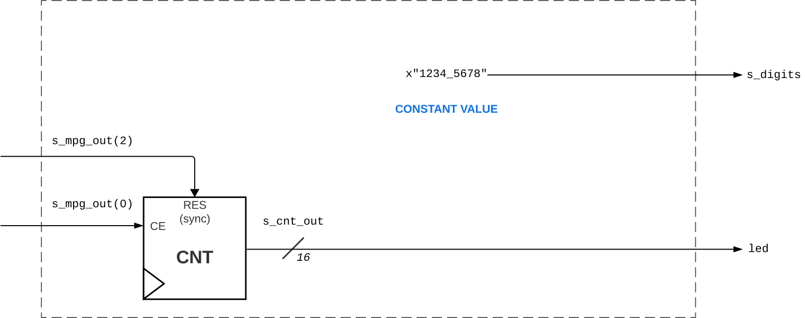
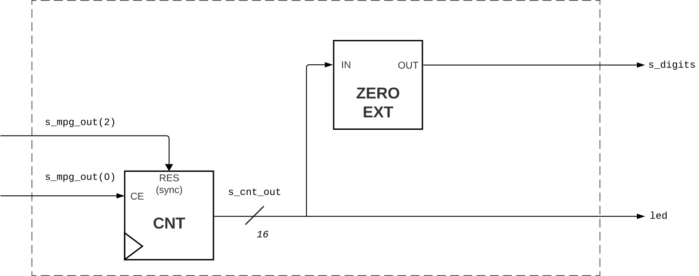
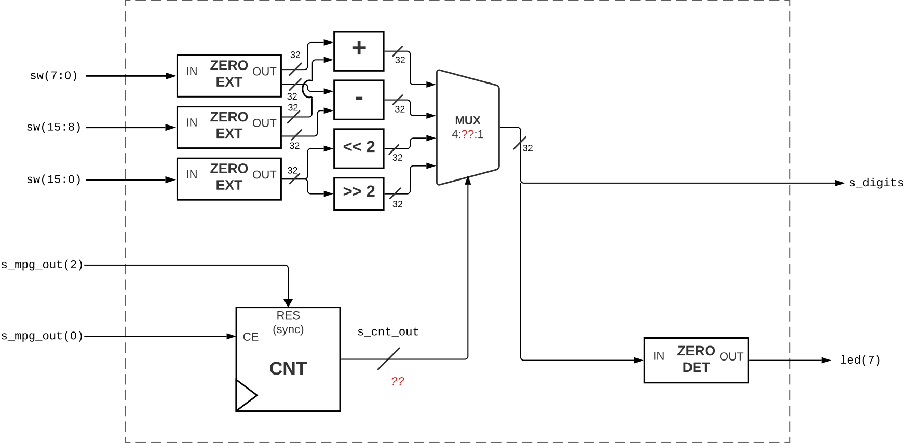
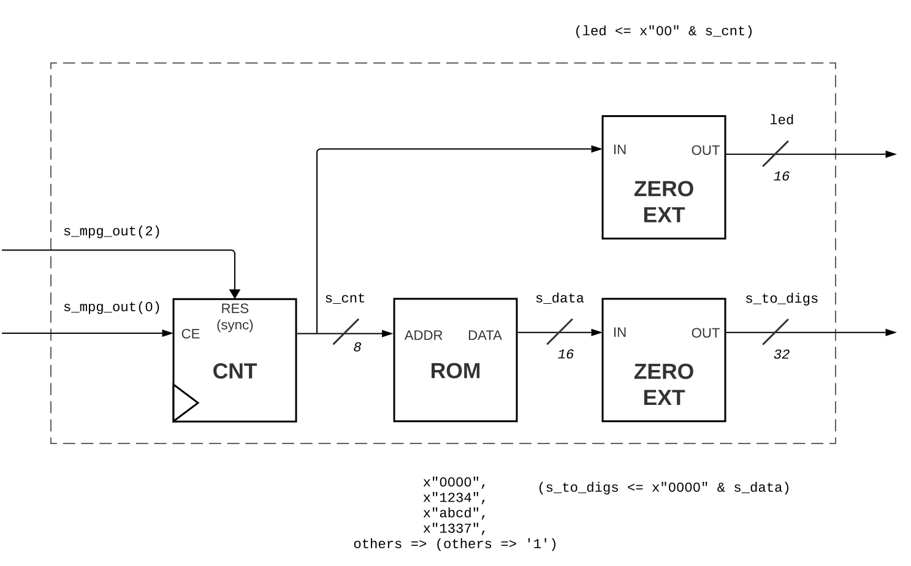
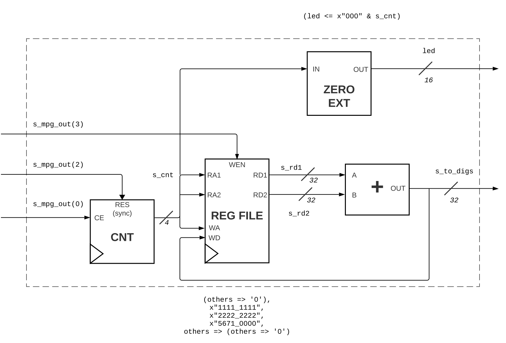
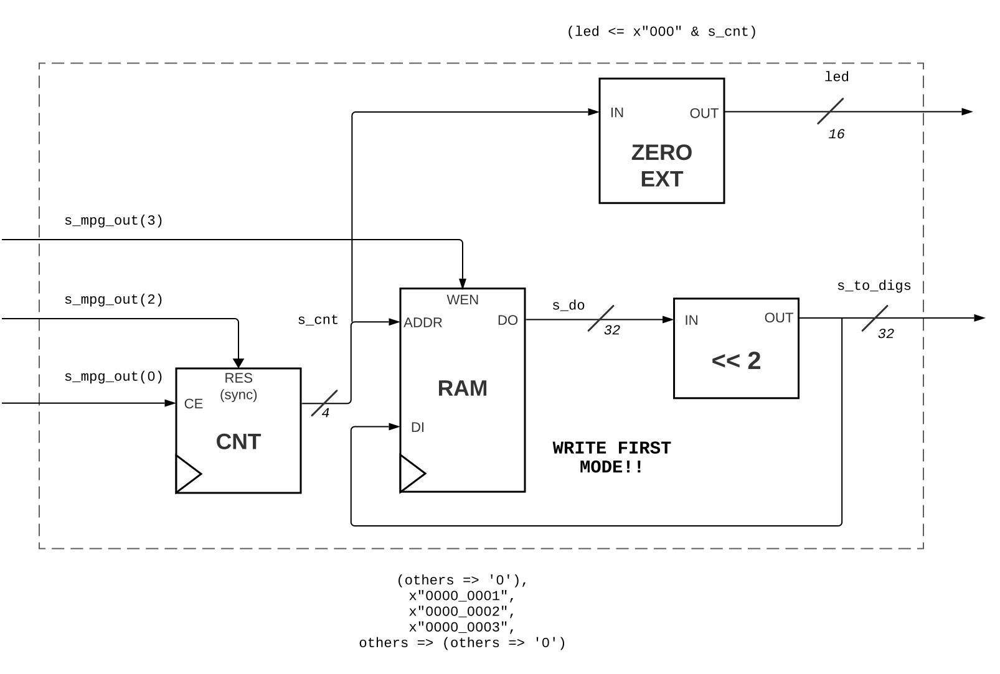

# Lab 3

**Prerequisites**:
- Mono Pulse Generator
- Seven Segment Display
- A Top-Level Module where the above two are declared + instantiated along with the input + output ports from the schematic below
- MOST IMPORTANT: **An understanding of how to analyze and put schematics to code**

## Main Test Environment (Top Level Module)

All of the exercises (necessary components) below will go into the "Black Box" section of the schematic.  

_Remember_: **UNLESS EXPLICITELY STATED, DO NOT CREATE ADDITIONAL FILES FOR COMPONENTS, JUST DIRECLTY IMPLEMENT IN THE TOP-LEVEL MODULE**  

Once you're ready with a certain assignment, then please raise your hand and show your implementation to the teacher. If everything is alright, then please upload your code to the repo before proceeding to another assignment.

## Exercise 1 - Const val to 7SD

## Exercise 2 - Counter to 7SD

## Exercise 3 - ALU

## Read Only Memory

## Register File
**IMPORTANT**: The _Reg File_ must be a separate entity (implement in its own file and then declare + instantiate in the top-level module)

## Random Access Memory
**IMPORTANT**: The _RAM_ must be a separate entity (implement in its own file and then declare + instantiate in the top-level module)
