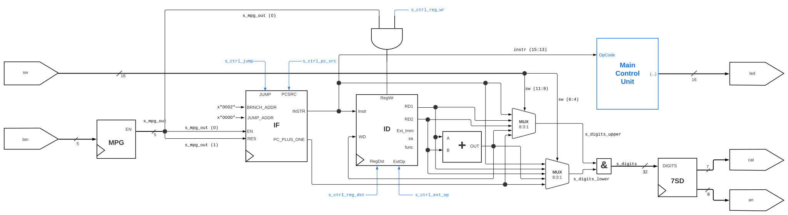
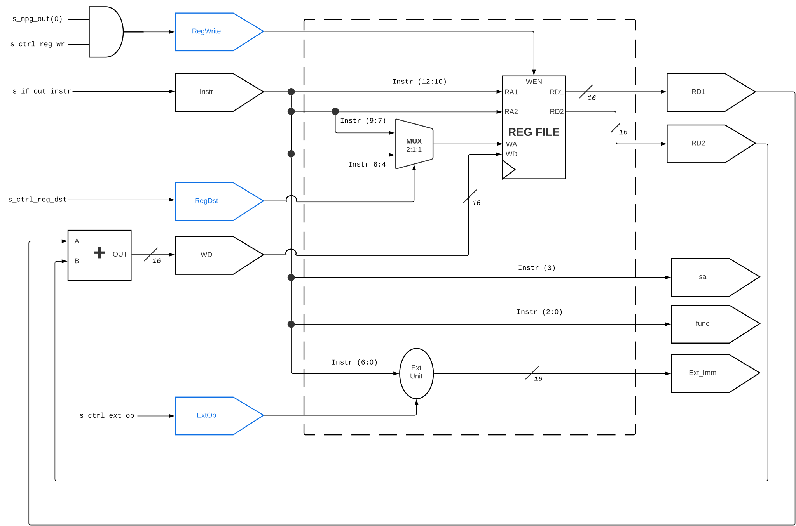

# MIPS - Phase 2 - Instruction Decode

## Main Test Environment (Top Level Module)





### Sample template for miscellaneous components in the Top-Level Module

```vhd
  -- MUX for 7-segment display left side (31 downto 16)
  process (sw(11 downto 9), s_if_out_pc_plus_one, s_if_out_instruction, s_id_out_rd1, s_id_out_rd2, s_id_in_wd)
  begin
    case sw(11 downto 9) is
      when "000"  => s_digits_upper <= s_if_out_instruction;
      when "001"  => s_digits_upper <= s_if_out_pc_plus_one;
      when "010"  => s_digits_upper <= s_id_out_rd1;
      when "011"  => s_digits_upper <= s_id_out_rd2;
      when "100"  => s_digits_upper <= s_id_in_wd;    
      when others => s_digits_upper <= s_if_out_instruction;
    end case;
  end process;

  -- MUX for 7-segment display right side (15 downto 0)
  process (sw(6 downto 4), s_if_out_pc_plus_one, s_if_out_instruction, s_id_out_rd1, s_id_out_rd2, s_id_in_wd)
  begin
    case sw(6 downto 4) is
      when "000"  => s_digits_lower <= s_if_out_instruction;
      when "001"  => s_digits_lower <= s_if_out_pc_plus_one;
      when "010"  => s_digits_lower <= s_id_out_rd1;
      when "011"  => s_digits_lower <= s_id_out_rd2;
      when "100"  => s_digits_lower <= s_id_in_wd;    
      when others => s_digits_lower <= s_if_out_instruction;
    end case;
  end process;

  s_digits <= s_digits_upper & s_digits_lower;

  -- LED with signals from Main Control Unit
  led <= s_ctrl_alu_op     & -- ALU operation        15:13
         b"0000_0"         & -- Unused               12:8
         s_ctrl_reg_dst    & -- Register destination 7
         s_ctrl_ext_op     & -- Extend operation     6
         s_ctrl_alu_src    & -- ALU source           5
         s_ctrl_branch     & -- Branch               4
         s_ctrl_jump       & -- Jump                 3
         s_ctrl_mem_write  & -- Memory write         2
         s_ctrl_mem_to_reg & -- Memory to register   1
         s_ctrl_reg_write;   -- Register write       0
```

_Remember_: **UNLESS EXPLICITELY STATED, DO NOT CREATE ADDITIONAL FILES FOR COMPONENTS, JUST DIRECLTY IMPLEMENT IN THE GIVEN MODULE**  

## Instruction Decode

**THE REGISTER FILE SHOULD BE A SEPARATE COMPONENT!**



### Sample template for the ID component

```vhdl
library ieee;
  use ieee.std_logic_1164.all;
  use ieee.std_logic_arith.all;
  use ieee.std_logic_unsigned.all;

entity instr_decode is
  port (
    -- inputs
    clk       : in  std_logic;
    instr     : in  std_logic_vector(15 downto 0);
    wd        : in  std_logic_vector(15 downto 0);
    -- control signal based inputs
    ext_op    : in  std_logic;
    reg_dst   : in  std_logic;
    reg_write : in  std_logic;
    -- outputs
    ext_imm   : out std_logic_vector(15 downto 0);
    func      : out std_logic_vector(2  downto 0);
    rd1       : out std_logic_vector(15 downto 0);
    rd2       : out std_logic_vector(15 downto 0);        
    sa        : out std_logic
  );
end instr_decode;

architecture behavioral of instr_decode is

  component reg_file
  port (
    clk : in  std_logic;
    ra1 : in  std_logic_vector(2  downto 0);
    ra2 : in  std_logic_vector(2  downto 0);
    wa  : in  std_logic_vector(2  downto 0);
    wd  : in  std_logic_vector(15 downto 0);
    wen : in  std_logic;
    rd1 : out std_logic_vector(15 downto 0);
    rd2 : out std_logic_vector(15 downto 0)
  );
  end component;

  -- *  
  -- NO OTHER EXTERNAL COMPONENT DECLARATION NECESSARY
  -- ADDITIONAL SIGNALS HERE

begin

  inst_rf : reg_file
  port map (
    clk => ,
    ra1 => ,
    ra2 => ,
    wa  => ,
    wd  => ,
    wen => ,
    rd1 => ,
    rd2 => 
  );

  -- **  
  -- NO OTHER EXTERNAL COMPONENT INSTANTIATION NECESSARY
  -- ADDITIONAL COMPONENT IMPLEMENTATION HERE

end behavioral;
```

### Sample template for declaration and instantiation in the top-level module

```vhdl

architecture behavioral of test_env is

  -- previous signals and component declarations

  component instr_decode
  port (
    clk       : in  std_logic;
    instr     : in  std_logic_vector(15 downto 0);
    wd        : in  std_logic_vector(15 downto 0);
    ext_op    : in  std_logic;
    reg_dst   : in  std_logic;
    reg_write : in  std_logic;
    ext_imm   : out std_logic_vector(15 downto 0);
    func      : out std_logic_vector(2  downto 0);
    rd1       : out std_logic_vector(15 downto 0);
    rd2       : out std_logic_vector(15 downto 0);
    sa        : out std_logic
  );
  end component;

  -- additional signals and component declarations

begin

  -- previous component instantiations / implementation

  inst_indcd : instr_decode
  port map (
    clk       => clk,
    instr     => s_if_out_instruction,
    wd        => s_id_in_wd,
    ext_op    => s_ctrl_ext_op,
    reg_dst   => s_ctrl_reg_dst,
    reg_write => s_id_in_reg_write,
    ext_imm   => s_id_out_ext_imm,
    func      => s_id_out_func,
    rd1       => s_id_out_rd1,
    rd2       => s_id_out_rd2,
    sa        => s_id_out_sa
  );

  -- additional component instantiations / implementation

end behavioral;
```

## Main Control Unit

### Sample template for CU component

```vhd
library ieee;
  use ieee.std_logic_1164.all;
  use ieee.std_logic_arith.all;
  use ieee.std_logic_unsigned.all;

entity control_unit is
  port (
    -- inputs
    op_code : in std_logic_vector(2 downto 0);
    -- outputs
    reg_dst    : out std_logic;
    ext_op     : out std_logic;
    alu_src    : out std_logic;
    branch     : out std_logic;
    jump       : out std_logic;
    alu_op     : out std_logic_vector(2 downto 0);
    mem_write  : out std_logic;
    mem_to_reg : out std_logic;
    reg_write  : out std_logic 
  );
end control_unit;

architecture behavioral of control_unit is

begin

    process(op_code)
    begin
      case op_code is
        when "000" =>
          reg_dst    <= '';
          ext_op     <= '';
          alu_src    <= '';
          branch     <= '';
          jump       <= '';
          alu_op     <= "";
          mem_write  <= '';
          mem_to_reg <= '';
          reg_write  <= '';
        when others =>
          reg_dst    <= '';
          ext_op     <= '';
          alu_src    <= '';
          branch     <= '';
          jump       <= '';
          alu_op     <= "";
          mem_write  <= '';
          mem_to_reg <= '';
          reg_write  <= '';
      end case;
    end process;  

end behavioral;
```

### Sample template for declaration and instantiation in the top-level module

```vhd
  component control_unit
  port (
    op_code    : in std_logic_vector(2 downto 0);
    reg_dst    : out std_logic;
    ext_op     : out std_logic;
    alu_src    : out std_logic;
    branch     : out std_logic;
    jump       : out std_logic;
    alu_op     : out std_logic_vector(2 downto 0);
    mem_write  : out std_logic;
    mem_to_reg : out std_logic;
    reg_write  : out std_logic
  );
  end component;

  inst_cu : control_unit
  port map (
    op_code    => s_if_out_instruction(15 downto 13),
    reg_dst    => s_ctrl_reg_dst,
    ext_op     => s_ctrl_ext_op,
    alu_src    => s_ctrl_alu_src,
    branch     => s_ctrl_branch,
    jump       => s_ctrl_jump,
    alu_op     => s_ctrl_alu_op,
    mem_write  => s_ctrl_mem_write,
    mem_to_reg => s_ctrl_mem_to_reg,
    reg_write  => s_ctrl_reg_write
  );
```
