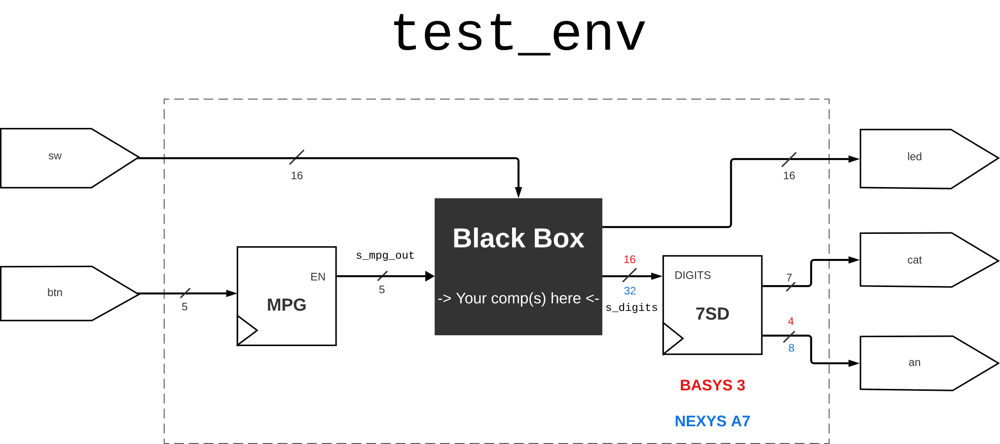
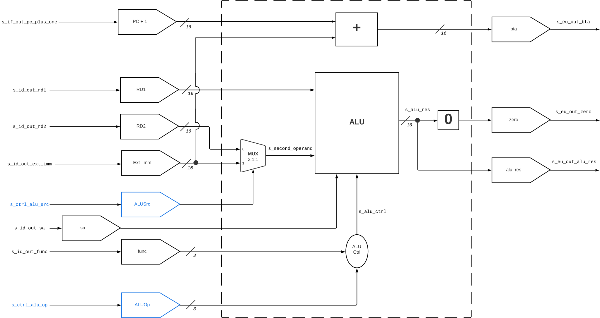

# MIPS - Phase 3 & 4 - Execution Unit & Memory Unit + Write-back Unit

## Main Test Environment (Top Level Module)


### Sample template for miscellaneous components in the Top-Level Module

```vhd
  -- MUX for 7-segment display left side (31 downto 16)
  process (sw(11 downto 9), s_if_out_pc_plus_one, s_if_out_instruction, s_id_out_rd1, s_id_out_rd2, s_id_in_wd)
  begin
    case sw(11 downto 9) is
      when "000"  => s_digits_upper <= s_if_out_instruction;
      when "001"  => s_digits_upper <= s_if_out_pc_plus_one;
      when "010"  => s_digits_upper <= s_id_out_rd1;
      when "011"  => s_digits_upper <= s_id_out_rd2;
      when "100"  => s_digits_upper <= s_id_out_ext_imm;
      when "101"  => s_digits_upper <= s_eu_out_alu_res;
      when "110"  => s_digits_upper <= s_mu_out_mem_data;
      when "111"  => s_digits_upper <= s_wb_out_wd;
    end case;
  end process;

  -- MUX for 7-segment display right side (15 downto 0)
  process (sw(6 downto 4), s_if_out_pc_plus_one, s_if_out_instruction, s_id_out_rd1, s_id_out_rd2, s_id_in_wd)
  begin
    case sw(6 downto 4) is
      when "000"  => s_digits_lower <= s_if_out_instruction;
      when "001"  => s_digits_lower <= s_if_out_pc_plus_one;
      when "010"  => s_digits_lower <= s_id_out_rd1;
      when "011"  => s_digits_lower <= s_id_out_rd2;
      when "100"  => s_digits_lower <= s_id_out_ext_imm;
      when "101"  => s_digits_lower <= s_eu_out_alu_res;
      when "110"  => s_digits_lower <= s_mu_out_mem_data;
      when "111"  => s_digits_lower <= s_wb_out_wd;
    end case;
  end process;

  s_digits <= s_digits_upper & s_digits_lower;

  -- LED with signals from Main Control Unit
  led <= s_ctrl_alu_op     & -- ALU operation        15:13
         b"0000_0"         & -- Unused               12:8
         s_ctrl_reg_dst    & -- Register destination 7
         s_ctrl_ext_op     & -- Extend operation     6
         s_ctrl_alu_src    & -- ALU source           5
         s_ctrl_branch     & -- Branch               4
         s_ctrl_jump       & -- Jump                 3
         s_ctrl_mem_write  & -- Memory write         2
         s_ctrl_mem_to_reg & -- Memory to register   1
         s_ctrl_reg_write;   -- Register write       0
```

_Remember_: **UNLESS EXPLICITELY STATED, DO NOT CREATE ADDITIONAL FILES FOR COMPONENTS, JUST DIRECLTY IMPLEMENT IN THE GIVEN MODULE**  

## Execution Unit


### Sample template for EU component

```vhd
library ieee;
  use ieee.std_logic_1164.all;
  use ieee.std_logic_arith.all;
  use ieee.std_logic_unsigned.all;

entity exec_unit is
  port (
    -- inputs
    ext_imm     : in std_logic_vector(15 downto 0);
    func        : in std_logic_vector(2  downto 0);
    rd1         : in std_logic_vector(15 downto 0);
    rd2         : in std_logic_vector(15 downto 0);        
    pc_plus_one : in std_logic_vector(15 downto 0);
    sa          : in std_logic;
    -- control signals
    alu_op    : in  std_logic_vector(2 downto 0);
    alu_src   : in  std_logic;
    -- outputs
    alu_res : out std_logic_vector(15 downto 0);
    bta     : out std_logic_vector(15 downto 0);
    zero    : out std_logic
  );
end entity;

architecture rtl of exec_unit is

  signal s_alu_control    : std_logic_vector(2  downto 0);
  signal s_alu_res        : std_logic_vector(15 downto 0);
  signal s_second_operand : std_logic_vector(15 downto 0);

begin

  -- ALU Control
  process (alu_op, func)
  begin
    case alu_op is
      when "000" =>
        case func is
            when "000"  => s_alu_control <= ""; -- ADD
            when "001"  => s_alu_control <= ""; -- SUB
            when "010"  => s_alu_control <= ""; -- SLL
            when "011"  => s_alu_control <= ""; -- SRL
            when "100"  => s_alu_control <= ""; -- AND
            when "101"  => s_alu_control <= ""; -- OR
            when others => s_alu_control <= "";
        end case;        
      when "001"  => s_alu_control <= ""; -- ADDI
      when "010"  => s_alu_control <= ""; -- LW
      when "011"  => s_alu_control <= ""; -- SW
      when "100"  => s_alu_control <= ""; -- BEQ
      when others => s_alu_control <= "111";
    end case;
  end process;

  -- MUX for Second Operand
  s_second_operand <= ;

  -- ALU
  process (s_alu_control, sa, rd1, s_second_operand)
  begin
    case s_alu_control is
      when "000"  => s_alu_res <= ;
      when "001"  => s_alu_res <= ;
      when "010"  => s_alu_res <= ;
      when "011"  => s_alu_res <= ;
      when "100"  => s_alu_res <= ;
      when "101"  => s_alu_res <= ;
      when others => s_alu_res <= (others => '0');
    end case;    
  end process;
  
  alu_res <= s_alu_res; -- DUE TO ZERO FLAG, output cannot be a variable for condition in 'when' statement

  -- Branch Target Address
  bta <= ;
 
  -- Zero Flag
  zero <= ;

end architecture;
```

### Sample template for declaration and instantiation in the top-level module

```vhd
  -- Execution Unit
  signal s_eu_out_alu_res : std_logic_vector(15 downto 0) := x"0000";
  signal s_eu_out_bta     : std_logic_vector(15 downto 0) := x"0000";
  signal s_eu_out_zero    : std_logic                     := '0';

  component exec_unit
  port (
    ext_imm     : in  std_logic_vector(15 downto 0);
    func        : in  std_logic_vector(2  downto 0);
    rd1         : in  std_logic_vector(15 downto 0);
    rd2         : in  std_logic_vector(15 downto 0);
    pc_plus_one : in  std_logic_vector(15 downto 0);
    sa          : in  std_logic;
    alu_op      : in  std_logic_vector(2  downto 0);
    alu_src     : in  std_logic;
    alu_res     : out std_logic_vector(15 downto 0);
    bta         : out std_logic_vector(15 downto 0);
    zero        : out std_logic
  );
  end component;

  exec_unit_inst : exec_unit
  port map (
    ext_imm     => ,
    func        => ,
    rd1         => ,
    rd2         => ,
    pc_plus_one => ,
    sa          => ,
    alu_op      => ,
    alu_src     => ,
    alu_res     => ,
    bta         => ,
    zero        => 
  );
```
## Memory Unit
### Sample template for MU component
```vhd
library ieee;
  use ieee.std_logic_1164.all;
  use ieee.std_logic_arith.all;
  use ieee.std_logic_unsigned.all;

  entity mem_unit is
    port (
      -- INPUTS
      clk        : in std_logic;
      alu_res_in : in std_logic_vector(15 downto 0);
      rd2        : in std_logic_vector(15 downto 0);
      -- CONTROL SIGNALS
      mem_write : in std_logic;
      -- OUTPUTS
      mem_data    : out std_logic_vector(15 downto 0);
      alu_res_out : out std_logic_vector(15 downto 0)
    );
  end entity;
  
  architecture rtl of mem_unit is

    component ram
    port (
      clk  : in  std_logic;
      wen  : in  std_logic;
      addr : in  std_logic_vector(3  downto 0);
      di   : in  std_logic_vector(15 downto 0);
      do   : out std_logic_vector(15 downto 0)
    );
    end component;


  begin

    ram_inst : ram
    port map (
      clk  => clk,
      wen  => mem_write,
      addr => alu_res_in(3 downto 0),
      di   => rd2,
      do   => mem_data
    );

    alu_res_out <= alu_res_in;    
  
  end architecture;
```

### Sample template for declaration and instantiation in the top-level module
```vhd
  -- Memory Unit
  signal s_mu_in_mem_write : std_logic                     := '0';
  signal s_mu_out_mem_data : std_logic_vector(15 downto 0) := x"0000";
  signal s_mu_out_alu_res  : std_logic_vector(15 downto 0) := x"0000";

  component mem_unit
  port (
    clk         : in  std_logic;
    alu_res_in  : in  std_logic_vector(15 downto 0);
    rd2         : in  std_logic_vector(15 downto 0);
    mem_write   : in  std_logic;
    mem_data    : out std_logic_vector(15 downto 0);
    alu_res_out : out std_logic_vector(15 downto 0)
  );
  end component;

  mem_unit_inst : mem_unit
  port map (
    clk         => ,
    alu_res_in  => ,
    rd2         => ,
    mem_write   => ,
    mem_data    => ,
    alu_res_out => 
  );

  -- MU related
  s_mu_in_mem_write <= s_ctrl_mem_write and s_mpg_out(0);
```
