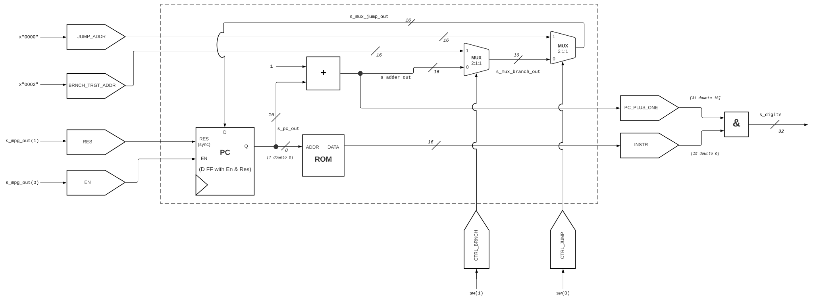

# MIPS - Phase 1 - Instruction Fetch

## Main Test Environment (Top Level Module)


## Instruction Fetch
_Remember_: **UNLESS EXPLICITELY STATED, DO NOT CREATE ADDITIONAL FILES FOR COMPONENTS, JUST DIRECLTY IMPLEMENT IN THE GIVEN MODULE**  



### Sample template for the IF component

```vhdl
library ieee;
  use ieee.std_logic_1164.all;
  use ieee.std_logic_arith.all;
  use ieee.std_logic_unsigned.all;

entity inst_fetch is
  port (
    -- inputs
    clk                   : in  std_logic;
    branch_target_address : in  std_logic_vector(15 downto 0);
    jump_address          : in  std_logic_vector(15 downto 0);
    pc_en                 : in  std_logic;
    pc_reset              : in  std_logic;
    -- control signals
    ctrl_jump             : in  std_logic;
    ctrl_pc_src           : in  std_logic;
    -- outputs
    instruction           : out std_logic_vector(15 downto 0);
    pc_plus_one           : out std_logic_vector(15 downto 0)
  );
end inst_fetch;

architecture behavioral of inst_fetch is

  type t_rom is array (0 to 255) of std_logic_vector(15 downto 0);
  signal rom : t_rom := (
  --  opc rs  rt  rd sa func
    b"000_001_010_011_0_000", -- x"0530" add $3 <= $1 + $2
    b"000_110_100_010_0_001", -- x"1a21" sub $2 <= $6 - $4
    x"1234",
    x"abcd",
    x"1337",
    others => (others => '1')
  );
  
  -- *  
  -- NO OTHER EXTERNAL COMPONENT DECLARATION NECESSARY
  -- ADDITIONAL SIGNALS HERE

begin

  -- **  
  -- NO OTHER EXTERNAL COMPONENT INSTANTIATION NECESSARY
  -- ADDITIONAL COMPONENT IMPLEMENTATION HERE

end behavioral;
```

### Sample template for declaration and instantiation in the top-level module

```vhdl

architecture behavioral of test_env is

  -- previous signals and component declarations

  component inst_fetch
  port (
    clk                   : in  std_logic;
    branch_target_address : in  std_logic_vector(15 downto 0);
    jump_address          : in  std_logic_vector(15 downto 0);
    jump                  : in  std_logic;
    pc_src                : in  std_logic;
    pc_en                 : in  std_logic;
    pc_reset              : in  std_logic;
    instruction           : out std_logic_vector(15 downto 0);
    pc_plus_one           : out std_logic_vector(15 downto 0)
  );
  end component;

  -- additional signals and component declarations

begin

  -- previous component instantiations / implementation

  inst_infe : inst_fetch
  port map (
    clk                    => ,
    branch_target_address  => ,
    jump_address           => ,
    jump                   => ,
    pc_src                 => ,
    pc_en                  => ,
    pc_reset               => ,
    instruction            => ,
    pc_plus_one            => 
  );

  -- additional component instantiations / implementation

end behavioral;
```